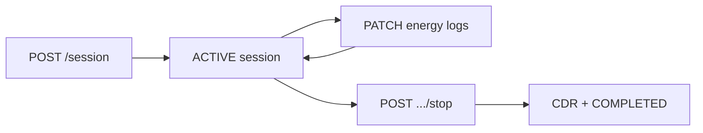

# EV Charging Session Service

A **Node.js** REST API for managing **electric-vehicle charging sessions**: start a session at a station, record energy readings while it is active, then stop the session and receive a **charge detail record (CDR)** with costs derived from a simple tariff model. The service persists state in **MongoDB** and exposes **OpenAPI** documentation and validated request/response contracts.

---

## How the application works

1. **Start session** (`POST /api/v1/session`)  
   Creates a new session with a generated `sessionId`, links it to `userId` and `stationId`, sets status to **ACTIVE**, and initializes empty `energyLogs`. Optional header **`Idempotency-Key`** ensures duplicate starts return the same session (stored in an `idempotency` collection).

2. **Update session** (`PATCH /api/v1/session/:id`)  
   While the session is **ACTIVE**, clients append **energy** samples to `energyLogs` (value + timestamp). If the session is not active, the API responds with a domain error.

3. **Stop session** (`POST /api/v1/session/:id/stop`)  
   - Atomically finds an **ACTIVE** session (with no CDR yet) and marks it **STOPPED**.  
   - Computes totals: energy from summed logs, duration from `createdAt` to now.  
   - **Tariff** (`DEFAULT_TARIFF` in domain constants): `energyCost = energy × energyRate`, `timeCost = duration(minutes) × timeRate`, `totalCost` = sum.  
   - Persists the CDR and final **COMPLETED** status inside a **MongoDB transaction**.  
   - **`Idempotency-Key`** on stop returns the same CDR for retries.

Supporting behavior:

- **Health**: `fastify-healthcheck` for liveness-style checks.  
- **Logging**: Request/response hooks attach trace context; **Pino** is used for structured logs.  
- **Errors**: Central Fastify error handler maps domain and validation errors to HTTP responses.  
- **Swagger UI**: Served under **`/docs`** with OpenAPI metadata from `@fastify/swagger`.



---

## Architecture and approach

The codebase follows a **layered, ports-and-adapters style** layout so HTTP and persistence can change without rewriting business rules:

| Layer | Role |
|--------|------|
| **`interfaces/`** | Routes, controllers, and **JSON Schema** for Fastify (request/response validation via **AJV**). |
| **`application/`** | **Use cases** orchestrate repositories and domain services; no direct HTTP types. |
| **`domain/`** | **Entities** (session shape), **constants** (status, tariff), and **TariffService** (pure cost calculation). |
| **`infrastructure/`** | **MongoDB** plugin (client, indexes, collections), **repositories**, **idempotency** plugin, **AJV** and **Swagger** plugins, logging hooks. |
| **`shared/`** | Env schema, errors, logging helpers, cross-cutting utilities. |

**Design choices:**

- **Use-case functions** receive `fastify` (for config, mongo, log) and return async handlers—simple composition without a heavy DI framework.  
- **Repositories** encapsulate MongoDB calls (`insertOne`, `findOne`, `findOneAndUpdate`, `updateOne`) and log queries for observability.  
- **Idempotency** uses a unique index on `(idempotencyKey, type)` with duplicate-key handling for races on start/stop.  
- **Validation**: Route-level JSON Schema + AJV (keywords, formats, custom error messages) keeps contracts explicit and aligns with OpenAPI generation.  
- **Environment**: `@fastify/env` loads and validates `process.env` against a single schema (`shared/schemas/env-schema.js`).

---

## Main packages

| Package | Purpose |
|---------|---------|
| **fastify** | HTTP server, plugins, lifecycle. |
| **@fastify/env** | Typed config from environment variables. |
| **@fastify/cors** | CORS (includes `idempotency-key` header). |
| **@fastify/swagger** / **@fastify/swagger-ui** | OpenAPI spec and `/docs` UI. |
| **fastify-healthcheck** | Health endpoint. |
| **fastify-plugin** | Encapsulated plugins with proper encapsulation. |
| **mongodb** | Official driver; sessions + idempotency collections, transactions on stop. |
| **ajv**, **ajv-errors**, **ajv-formats**, **ajv-keywords** | Compile-time validation for route schemas. |
| **pino** | Structured logging (used via Fastify logger). |
| **http-status-codes** | Consistent status constants in controllers. |
| **uuid** / **node:crypto** | Session IDs (`randomUUID`). |
| **dotenv** | Load `.env` in development. |

**Development:** ESLint, Prettier, nodemon, pino-pretty (see `package.json` scripts).

---

## Configuration

Variables are validated at startup (`@fastify/env`). Common ones:

| Variable | Description |
|----------|-------------|
| `PORT` | HTTP port (default `3000`). |
| `HOST` | Bind address (default `0.0.0.0`). |
| `NODE_ENV` | `development` \| `production` \| `local` (default `local`). |
| `LOG_LEVEL` | `debug` \| `info` \| `warn` \| `error`. |
| `DATABASE_URL` | MongoDB connection string (default local `mongodb://127.0.0.1:27017/ev_charging`). |
| `MONGO_DIRECT_CONNECTION` | `true` / `false` — when unset, single-host localhost URIs use `directConnection` to avoid replica-set hostname issues in Docker. |

---

## Prerequisites

- **Node.js** (ES modules; project uses `"type": "module"`).  
- **Docker** (recommended) or another **MongoDB** instance reachable at `DATABASE_URL`.

Stopping a session uses **MongoDB multi-document transactions**, which require a **replica set** (even a single-node replica set is enough). If you run MongoDB in Docker without Compose, start it with `--replSet` and run `rs.initiate()` once (see below).

---

## MongoDB locally with Docker (without Compose)

If you run the Node app on your machine (`npm run start` / `npm run start:dev`), you still need MongoDB. The default `DATABASE_URL` is `mongodb://127.0.0.1:27017/ev_charging`.

1. **Run MongoDB as a single-node replica set** (port `27017`):

   ```bash
   docker run -d \
     --name ev_charging \
     -p 27017:27017 \
     mongo:6 \
     --replSet rs0
   ```

   You can use `mongo:7` instead of `mongo:6` if you prefer; keep `--replSet rs0`.

2. **Initialize the replica set** (once per new data directory):

   ```bash
   docker exec -it ev_charging mongosh
   ```

   In the shell:

   ```javascript
   rs.initiate()
   ```

   Wait until the member becomes `PRIMARY` (`rs.status()`), then exit.

3. **Optional — inspect data** (database name matches the path in `DATABASE_URL`):

   ```javascript
   use ev_charging
   show collections
   db.sessions.find().pretty()
   ```

4. **Run the API** (from the project root):

   ```bash
   npm install
   npm run start:dev
   ```

---

## Run locally

```bash
npm install
# Ensure MongoDB is running (see above) and DATABASE_URL is correct
npm run start
```

Development with reload and pretty logs:

```bash
npm run start:dev
```

**Quality gate (lint + format check):**

```bash
npm run build
```

---

## Docker

### App image only (MongoDB already running on the host)

```bash
docker build -t ev-charging-session-service .
docker run --rm -p 3000:3000 \
  -e DATABASE_URL="mongodb://host.docker.internal:27017/ev_charging" \
  ev-charging-session-service
```

On Linux, `host.docker.internal` may be unavailable unless you add `--add-host=host.docker.internal:host-gateway`. Adjust `DATABASE_URL` if MongoDB runs elsewhere. Your MongoDB must be a **replica set** if you use the stop-session endpoint (see [MongoDB locally with Docker](#mongodb-locally-with-docker-without-compose)).

The image runs `node` with an increased HTTP header size limit (same as `npm start`).

### Docker Compose — API and MongoDB together

From the project root, build and start **both** the app and MongoDB:

```bash
docker compose up --build
```

- **API**: [http://localhost:3000/api/v1/…](http://localhost:3000/api/v1/)  
- **OpenAPI UI**: [http://localhost:3000/docs](http://localhost:3000/docs)  
- **Health**: [http://localhost:3000/health](http://localhost:3000/health)  
- **MongoDB** is also published on **localhost:27017** (optional tools: Compass, `mongosh`).

The `mongo` service runs as replica set `rs0`; the Compose healthcheck initializes it on first start so **transactions** (session stop / CDR) work without manual `rs.initiate()`. The app uses `DATABASE_URL=mongodb://mongo:27017/ev_charging` inside the stack.

Stop and remove containers (keep the named volume unless you add `-v`):

```bash
docker compose down
```

---

## API surface

Base path: **`/api/v1`**

| Method | Path | Summary |
|--------|------|---------|
| `POST` | `/session` | Start a charging session. |
| `PATCH` | `/session/:id` | Append energy reading for an active session. |
| `POST` | `/session/:id/stop` | Stop session and return CDR (costs + totals). |

- **Interactive contract**: [http://localhost:3000/docs](http://localhost:3000/docs) (when the server is running).  
- **Postman**: Import `postman/EV-CHARGING.postman_collection.json` for runnable examples.

---

## License

ISC (see `package.json`).
